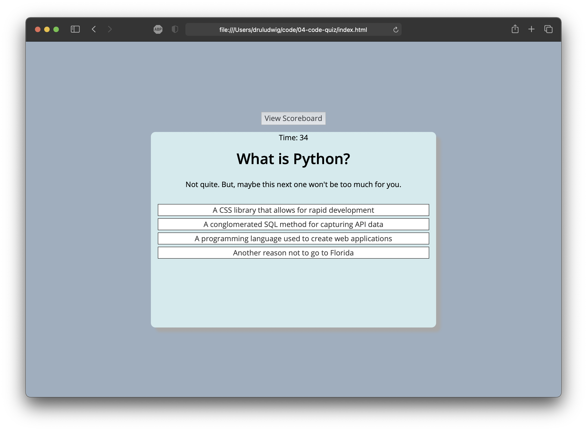

# Practice Code Quiz 1.0
 
Open App: https://druludwig.github.io/04-code-quiz/

## App Highlights
- The 1.0 version of the app meets the basic acceptance criteria listed in the README.
- The app tracks progress, credits correct scores, issues time penalties for incorrect answers, and displays a leaderboard.

## Personal Highlights
- During this project, something "clicked" and Javascript became a much more approachable language!
- My psudocoding skills (my ability to see the HTML, CSS, and Javascript code as "one") greatly improved during the development process.
- I had fun creating nonsense wrong answers during breaks to clear my mind.

## Next Version Features
The next iteration of this code quiz will include a number of improvements before it can become part of my final portfolio:
- The amount of HTML used will be reduced using dynamically created elements.
- Adjust the timer which occasionally jitters at quiz end.
- Add validation to check initials input.
- Add user friendly percent scores (e.g. 2/5 becomes 40%)
- Add mobile UI features.

 

## Screenshot

